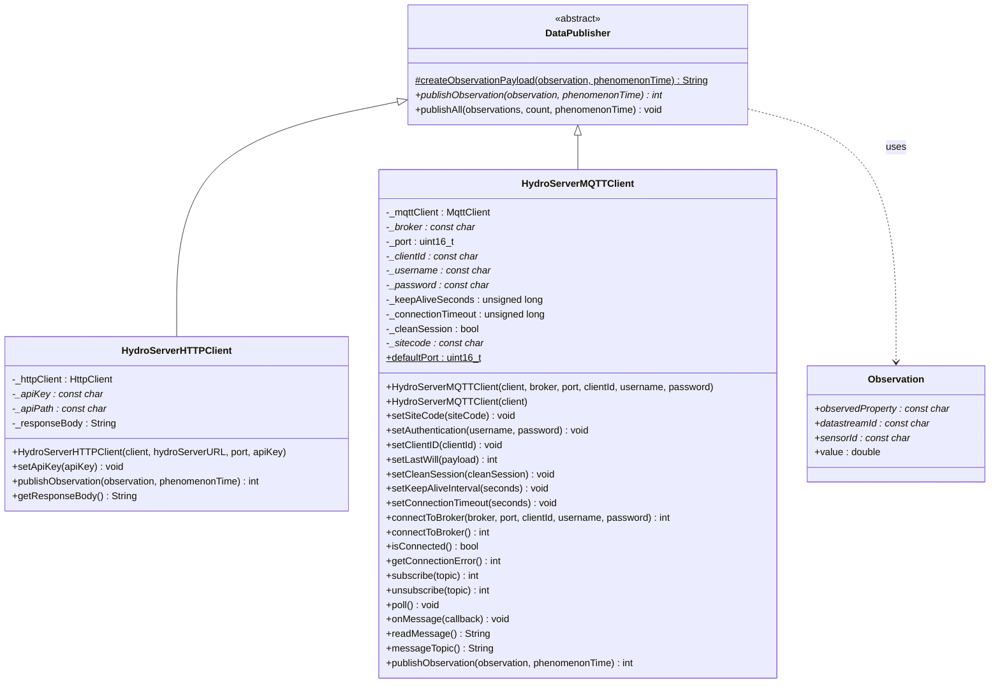

# HydroServerArduinoClient — Class Diagram

This diagram shows the class hierarchy for the HydroServerArduinoClient library:
`DataPublisher` is the abstract base class, implemented by both
`HydroServerHTTPClient` and `HydroServerMQTTClient`, each of which uses the
`Observation` struct to build and publish sensor data.

