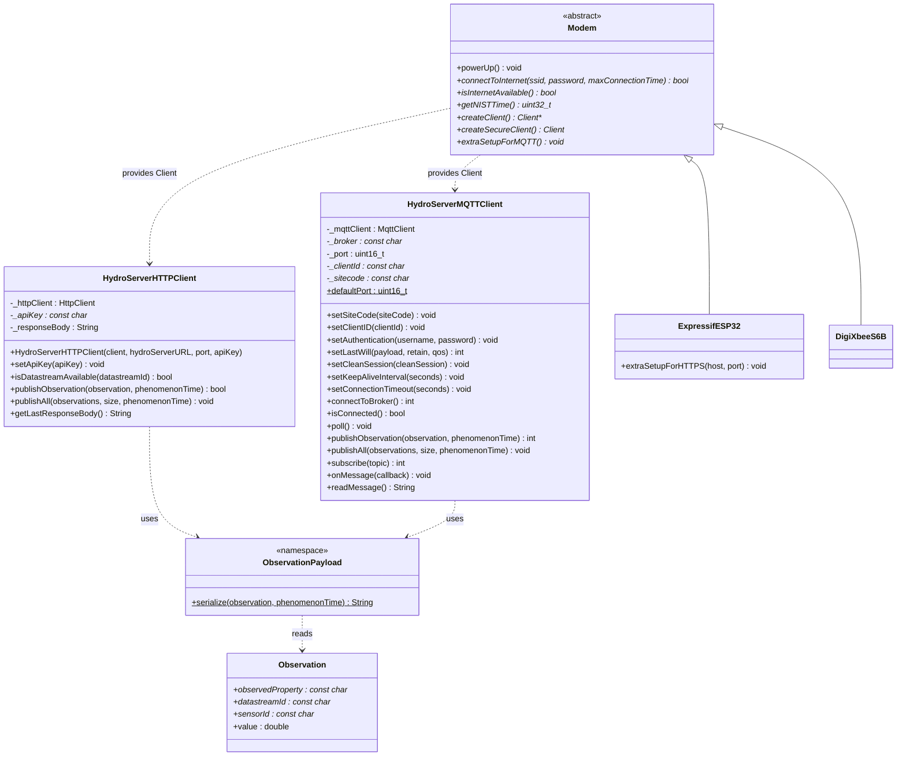

# Architecture

How **HydroServerArduinoClient** is put together. For method-by-method details, see the [API reference](apireference.md).

## Overview

The library has three layers. Your sketch only talks to the top two:

| Layer | Classes | Job |
| --- | --- | --- |
| **Data** | `Observation`, `ObservationPayload` | Describe a reading and turn it into SensorThings JSON. |
| **Publishers** | `HydroServerHTTPClient`, `HydroServerMQTTClient` | Send the JSON somewhere — HydroServer's API or an MQTT broker. |
| **Transport** | Any Arduino `Client`; optional `Modem` wrappers | Provide the network connection. |

A reading flows through them like this:

1. Your sketch reads a sensor and stores the value in an `Observation`.
2. It calls `publishObservation(observation, timestamp)` on a publisher.
3. The publisher calls `ObservationPayload::serialize()` to build the JSON.
4. The publisher sends it over the `Client` it was given:
   - **HTTP:** `POST /api/sensorthings/v1.1/Observations` to HydroServer, authenticated with an API key.
   - **MQTT:** publish to `<siteCode>/<clientId>/<sensorId>/<observedProperty>` on the broker. A separate service subscribed to the broker forwards the data into HydroServer.

## Design decisions

**One payload format for both publishers.** Both clients call the same `ObservationPayload::serialize()`, so switching from MQTT to HTTP (or running both) needs no change to how observations are built.

**Publishers don't share a base class.** Each publisher is a standalone class with the same `publishObservation()` / `publishAll()` shape. This keeps each one simple and avoids virtual calls on small boards. (Earlier versions had an abstract `DataPublisher` base class; it has been removed.)

**Network-agnostic.** Publishers accept any Arduino `Client`, so the same code runs on the Uno R4 WiFi (`WiFiClient`), the Mayfly (TinyGSM clients from the modem wrappers), or any other board with a `Client` implementation.

**Wrap, don't reinvent.** `HydroServerMQTTClient` wraps ArduinoMqttClient and `HydroServerHTTPClient` wraps ArduinoHttpClient. The wrappers add topic building, payload formatting and HydroServer-specific headers and paths; the underlying libraries do the protocol work.

**Modems are optional.** The `Modem` classes exist because the Mayfly's Bee modules need extra steps (powering the socket, AT-command setup, time sync) before a `Client` is usable. Boards with built-in networking don't need them.

**Time comes from the sketch.** The library never reads a clock. The sketch passes an ISO 8601 timestamp to each publish call, so it works with whatever RTC the board has.

## Class structure

## Source files

| File | Contents |
| --- | --- |
| `src/PublisherUtil.h` | `Observation` struct and `ObservationPayload::serialize()`. |
| `src/HydroServerHTTPClient.h/.cpp` | HTTP(S) publisher. |
| `src/HydroServerMQTTClient.h/.cpp` | MQTT publisher and subscriber. |
| `src/modems/modem.h` | Abstract `Modem` interface. |
| `src/modems/ExpressifESP32.h/.cpp` | ESP32 AT-firmware Bee. |
| `src/modems/DigiXbeeS6B.h/.cpp` | Digi XBee S6B Wi-Fi Bee. |

## Dependencies

| Library | Used by |
| --- | --- |
| ArduinoJson | `ObservationPayload`, `deserializePayload()` |
| ArduinoMqttClient | `HydroServerMQTTClient` |
| ArduinoHttpClient | `HydroServerHTTPClient` |
| EnviroDIY TinyGSM fork | Modem wrappers |
| StreamDebugger | Modem wrappers (debug output) |
